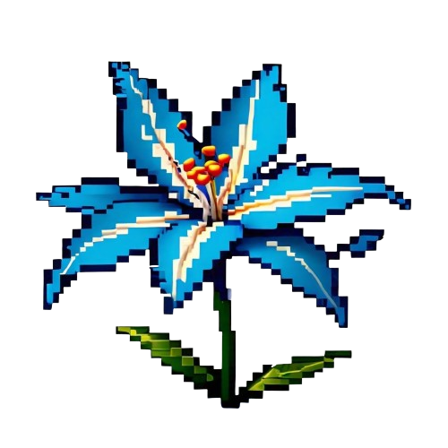

# Azure Reverie

  

## Description
Azure Reverie is a 2D platformer game developed for the IGDC Game Connect Kolkata hosted by Red Apple Learning & SCOPE Gaming Community. The game explores themes of memory, time travel, and upside-down worlds through a poignant story of a young boy coming to terms with the concept of loss and death.

## Table of Contents
- [Installation](#installation)
- [Game Story](#game-story)
- [Features](#features)
- [Controls](#Controls)
- [Game Design Document](#Game-Design-Document)
- [License](#license)
- [Contact Information](#contact-information)

## Installation
To run the game locally, follow these steps:
1. Download the zip file from the given link below.
2. Extract the zip file onto your PC.
3. Open the extracted folder, inside run the file "Azure Reverie.exe".
4. Now, Enjoy the game.
!! Happy Gaming !!

Download the latest release of the game [here](https://drive.google.com/file/d/1-9ARv8xYlQ97-qO2722GeC1L_qRuf6zN/view?usp=sharing).

## Game Story
### Synopsis
The story begins with a young lad witnessing his grandmother's funeral. The young boy, too young to grasp the concept of death, is intrigued by the bouquet of blue flowers on her coffin. He learns that these flowers are called "forget me nots," symbolizing true love and remembrance.

The boy believes his grandparents will return from heaven. That night, he has a lucid dream exploring loss, time, and the significance of memories.

### General Timeline
- **Introduction:** The boy at his grandmother's funeral, questions death and the significance of the flowers.
- **Discovery:** The boy discovers the magical properties of the forget-me-not flowers and travels to his grandparents' past.
- **Exploration:** The boy navigates an upside-down world of memories and faces challenges reflecting memory, loss, and love.
- **Resolution:** The boy gains a deeper understanding of life and death, cherishing the memories of his grandparents.

## Features
- **Themes:** Forget me not, Time Travel/Reversal, Upside down.
- **Genre:** 2D Platformer, Pixel Art, Singleplayer.
- **Mechanics:** Time and Gravity Manipulation.
- **Engine:** Unity.

## Controls
- Movement : A,D or Left_Arrow,Right_Arrow
- Jump : Space
- Double Jump : Space x 2
- Air Dash : Space + Left_Shift
- Interact : Return 

## Game Design Document
You can view the detailed Game Design Document [here](./GameDesignDocument.pdf).

## License
This project is licensed under the MIT License - see the [LICENSE](LICENSE) file for details.

## Contact Information
For any questions or suggestions, feel free to contact the team members:
- [Tirth Pinkal Sheth](https://github.com/TirthPinkalSheth)
- [Ajitesh Gupta](https://github.com/LastCypher)
- [Chetan Khoche](https://github.com/C-K-Devs)
